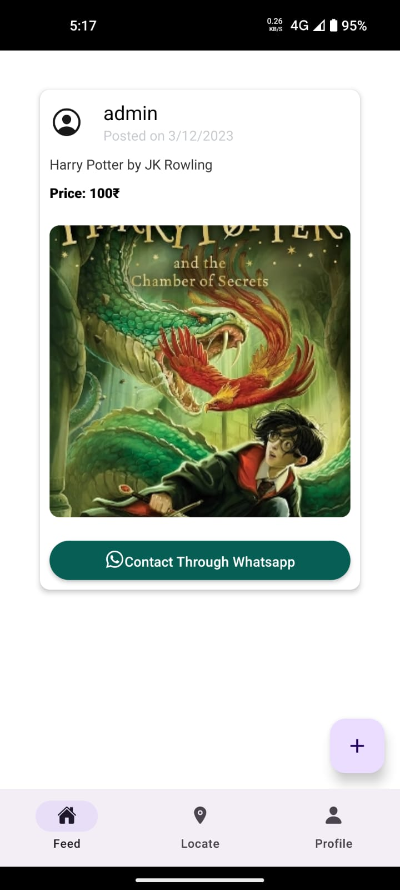
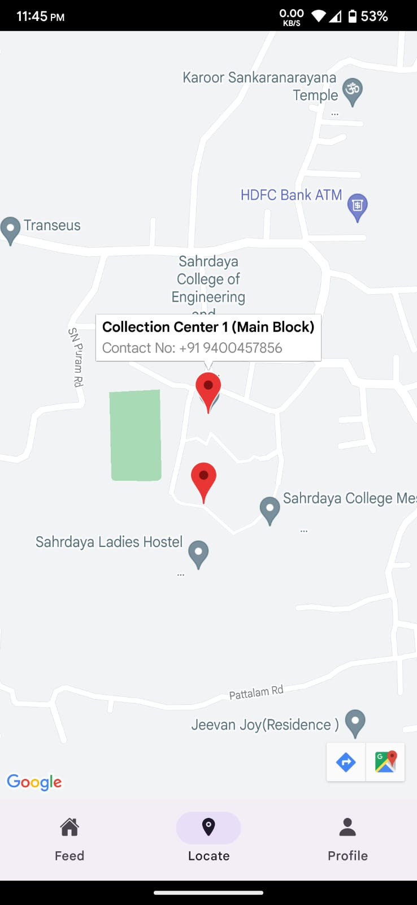

# CBT (Cloth, Book, Trash) APP 

React Native App for donating/selling used or unused clothes and books and for requesting a doorstep trash pickup.

## Screenshots

| |  |
| --------------------------------------- | --------------------------------------- |
|  | | 
| |


## Tech Stack

- React Native
- Firebase (For Authentication, as a file server, as a database)


## Run Locally

Clone the project

```bash
  git clone https://github.com/vivekkj123/cbt-app.git
```

Go to the project directory

```bash
  cd cbt-app
```

Install dependencies

```bash
  npm install
```

Start the metro server

```bash
  npm run start
```

Run the emulator

```bash
  npm run android
```


## Download

Download from [releases](https://github.com/vivekkj123/cbt-app/releases) page.


## Contributing

Contributions are always welcome! This project was developed for my third semester project exhibition for the course sustainable engineering. If anyone interested in making it better you're always welcome 🤗


## License

[MIT](https://choosealicense.com/licenses/mit/)

